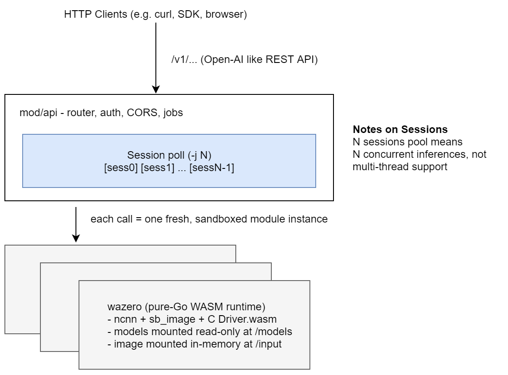
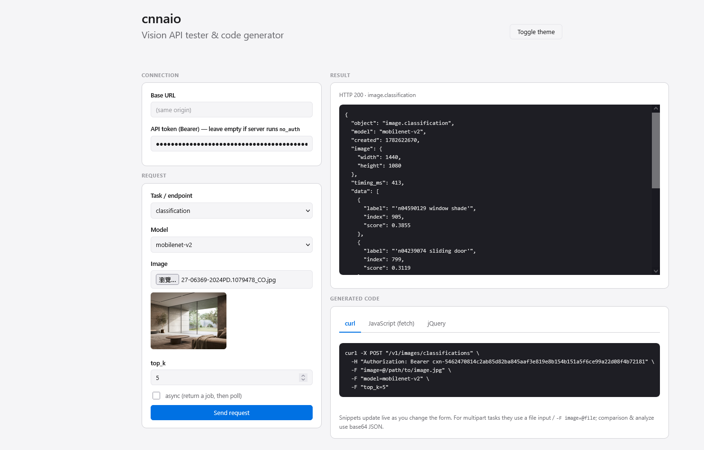
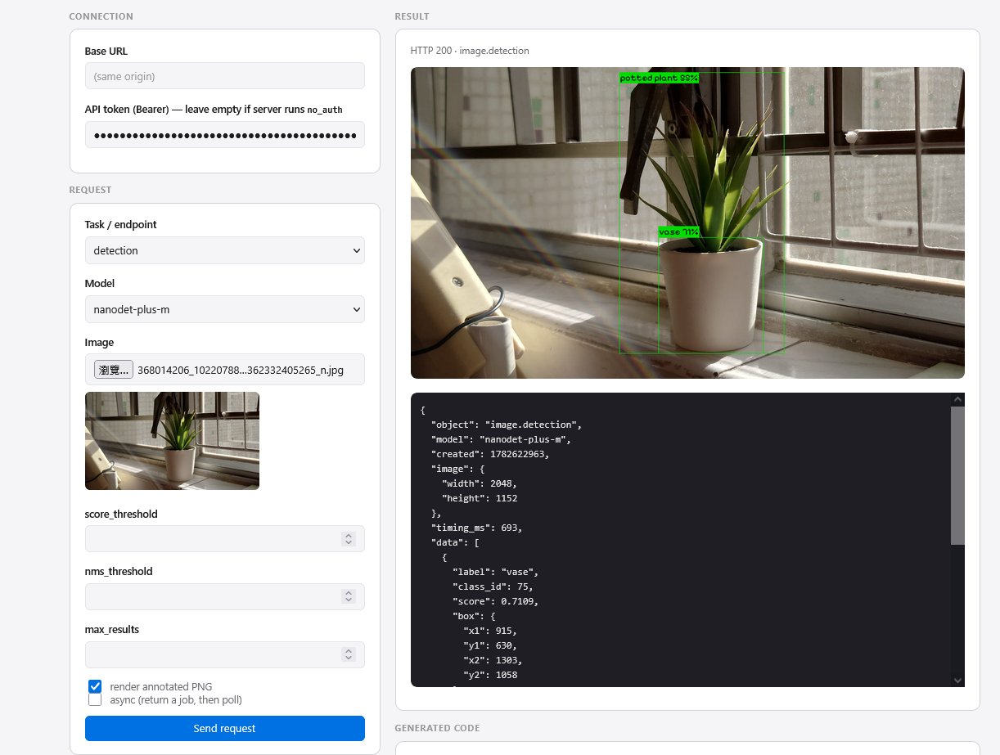
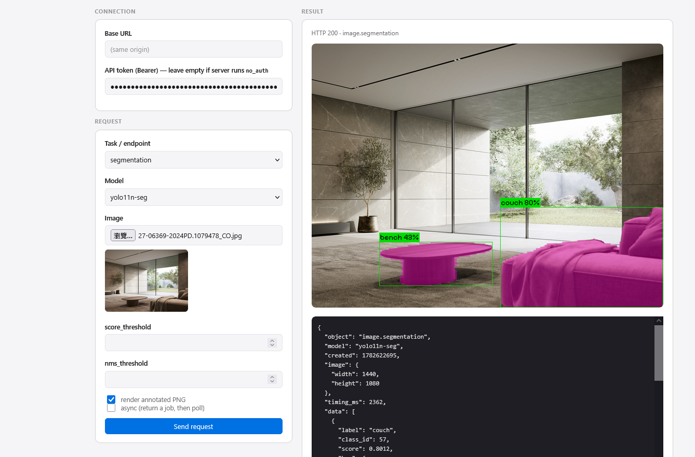
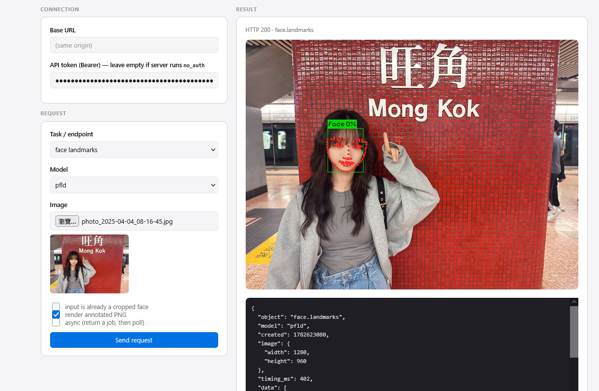
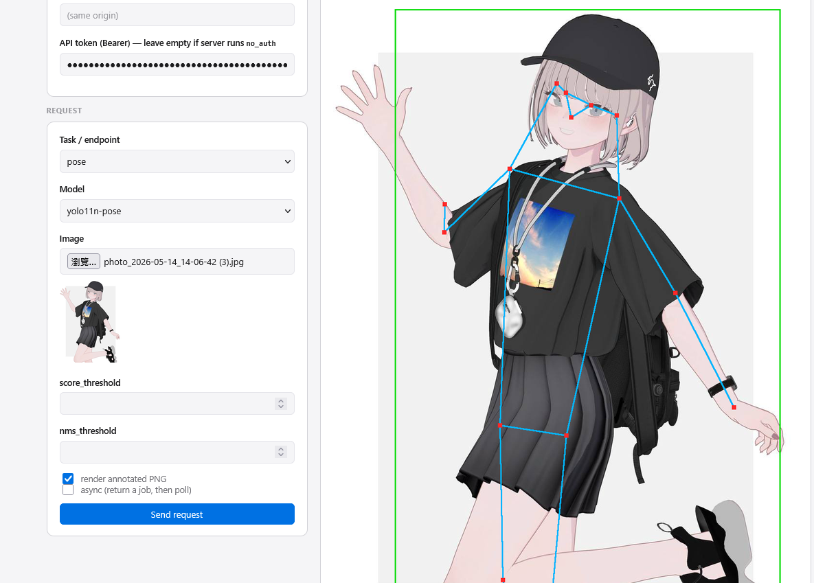
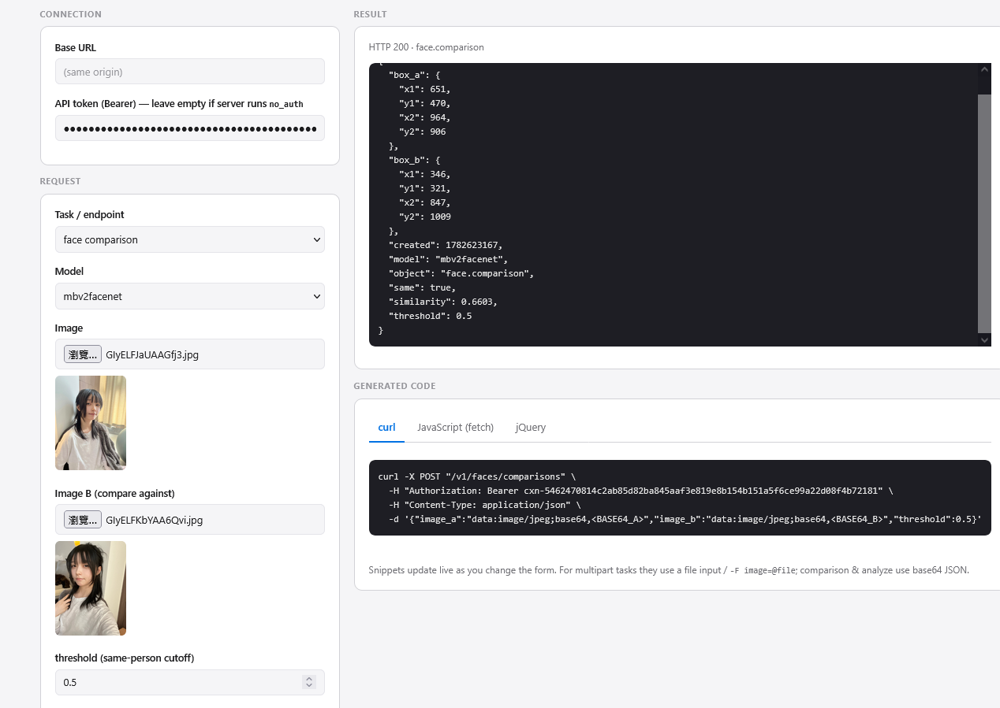

# cnnaio

**All-in-one CNN inference server for low-power homelab servers.**

cnnaio bundles a family of computer-vision models — image classification, object
detection, segmentation, pose, oriented boxes, face detection, facial landmarks,
face recognition and gender classification — behind a single, self-contained,
**OpenAI-style REST API**. 

It is written in pure Go with **zero external runtime dependencies**: 
no Python, no cgo, no CUDA, no system libraries, and no model files to download. 
One binary, drop it on a Raspberry Pi or an old NUC, and you have a vision API.


## Introduction

The core of the cnnaio is [**ncnn**](https://github.com/Tencent/ncnn) — the Nihui Convolution Neural Network, 
purpose-built for mobile and edge CPUs. Instead of linking ncnn through cgo,
cnnaio compiles ncnn (plus `stb_image` and a tiny C driver) to a **WebAssembly**
module and runs it inside [**wazero**](https://github.com/tetratelabs/wazero), a pure-Go WASM runtime. The result:

- **Pure Go, `CGO_ENABLED=0`.** Cross-compiles to Windows / macOS / Linux on
  amd64 + arm64 with no per-target toolchain.
- **Everything embedded.** The wasm runtime *and* every model's weights are
  baked into the binary via `go:embed`. Nothing to install, nothing to ship
  alongside it.
- **Familiar API.** The HTTP surface mirrors the **OpenAI API** conventions —
  `/v1/...` paths, `Authorization: Bearer <key>`, JSON `snake_case` bodies, a
  `model` field, and a consistent response envelope — so it's trivial to wrap
  with existing client patterns.
- **Two ways to use it.** Run it as an HTTP **server**, or import the `mod/*`
  packages and call the models directly as a **Go library**.


## Features

- **11 models across 11 vision tasks** — classification (MobileNetV2,
  YOLO11-cls), detection (YOLO11, NanoDet-Plus), segmentation, pose, oriented
  boxes (OBB), face detection (Ultra-Light), 98-point landmarks (PFLD), face
  embedding + comparison (MobileFaceNet), and gender classification.
- **OpenAI-style REST API** — versioned `/v1/*` endpoints, Bearer auth, JSON
  or multipart image input, consistent envelope with `object` / `model` /
  `data`, and OpenAI-shaped error objects.
-  **Pure Go, no dependencies** — ncnn runs as wasm inside wazero. No cgo, no
  native libraries, no model downloads. `CGO_ENABLED=0` cross-compilation.
-  **Concurrency via session pool** — `-j N` runs N isolated inference
  sessions for N concurrent requests.
-  **Built-in rendering** — ask for `?preview` (or `"render": true`) and get
  the annotated PNG back: boxes, labels, landmark dots, pose skeletons, oriented
  polygons, segmentation masks.
-  **Batch & async** — submit arrays of images, or fire-and-poll long jobs via
  `202` + `GET /v1/jobs/{id}`.
-  **Developer web UI** — `-dev` serves an interactive API tester that
  uploads an image, shows the JSON + annotated result, and generates
  curl / fetch / jQuery snippets. The UI is embedded in the binary via
  `go:embed`, so it works even on a bare release binary with no `./web`
  folder alongside it.
-  **Usable as a library** — import `cnnaio/mod/*` and call the models
  directly on a shared `ncnn.Session`. See [`example/`](example/).
-  **Single self-contained binary** — ideal for homelabs, edge boxes, and
  air-gapped deployments.


## Architecture




**WASM isolation.** ncnn is compiled to a WASI wasm module and executed by
wazero. Each inference *instantiates a fresh module instance* with its model
files mounted read-only and the input image handed in through an in-memory
filesystem — so calls share no state, nothing is written to the host disk, and a
misbehaving inference can't escape the sandbox. There is no cgo and no native
code execution on the host.

**Multi-session concurrency.** An `ncnn.Session` owns the wazero runtime and the
*compiled* wasm (compiling it once costs a few hundred ms). A session runs calls
**serially**, so the server keeps a **pool of `-j N` sessions** — N independent
runtimes that serve up to N requests in parallel. The same primitive is exposed
to library users: make one session and reuse it, or make several for
concurrency.

**No external dependencies.** Both the wasm and every model's weights are
embedded with `go:embed`. A built binary needs no Python, no model directory, no
shared libraries — and `CGO_ENABLED=0` means it cross-compiles to every target
without a C toolchain.


## Usage

### Build / run

```sh
go run .            # start the server (config from conf/config.json)
# or build a self-contained binary:
go build -o cnnaio . && ./cnnaio
```

> The embedded wasm (`mod/ncnn/ncnn_classify.wasm`) ships in the repo, so for
> normal use you only need Go. To rebuild the wasm from source, see
> [Build from source](#build-from-source) below.

### Build from source

The prebuilt ncnn wasm (`mod/ncnn/ncnn_classify.wasm`) is committed, so a plain
`go build .` just works. You only need this section if you want to **rebuild the
wasm** from the C sources. That requires two large SDKs that are *not* committed
to git:

| Dependency | Lands in | Source |
|------------|----------|--------|
| ncnn WebAssembly (prebuilt static lib + headers) | `./ncnn-20260526-webassembly/` | [ncnn releases](https://github.com/Tencent/ncnn/releases/tag/20260526) |
| WASI SDK 33 (the clang toolchain) | `./build/wasi-sdk-33.0-<arch>-<os>/` | [wasi-sdk releases](https://github.com/WebAssembly/wasi-sdk/releases/tag/wasi-sdk-33) |

#### Automatic (recommended)

`configure.sh` detects your OS/arch, downloads both, and extracts them into the
right place:

```sh
./configure.sh          # download the two SDKs (add --force to re-download)
bash build/build.sh     # compile ncnn -> mod/ncnn/ncnn_classify.wasm
go build -o cnnaio .    # build the server
make                    # optional: cross-platform release bundles -> ./dist
```

Requirements: `bash`, `curl` (or `wget`), `tar`, and an unzip capability
(`unzip` on Linux; Git Bash on Windows and macOS use their built-in archivers).

#### Manual download

If `configure.sh` can't reach GitHub, fetch the two archives yourself:

1. **ncnn** — download `ncnn-20260526-webassembly.zip` from the
   [ncnn 20260526 release](https://github.com/Tencent/ncnn/releases/tag/20260526)
   and extract it at the **repo root** so you have
   `./ncnn-20260526-webassembly/basic/`.
2. **WASI SDK** — download the archive for your platform from the
   [wasi-sdk-33 release](https://github.com/WebAssembly/wasi-sdk/releases/tag/wasi-sdk-33)
   and extract it into **`./build/`** so you have
   `./build/wasi-sdk-33.0-<arch>-<os>/bin/clang`:
   - Windows: `wasi-sdk-33.0-x86_64-windows.tar.gz`
   - Linux: `wasi-sdk-33.0-x86_64-linux.tar.gz` (or `-arm64-linux`)
   - macOS: `wasi-sdk-33.0-arm64-macos.tar.gz` (or `-x86_64-macos`)

Then run `bash build/build.sh`.

### Server flags

| Flag       | Default            | Meaning                                                           |
|------------|--------------------|-------------------------------------------------------------------|
| `-nt`      | —                  | Generate a new API token, store it in `./token/tokens.json`, print it, exit. |
| `-j`       | `1`                | Number of ncnn inference sessions = concurrency (each compiles the wasm once). |
| `-addr`    | (from config)      | Listen address override, e.g. `:9000`.                            |
| `-config`  | `conf/config.json` | Config file path (created with defaults if missing).              |
| `-dev`     | off                | Serve the developer web UI (API tester) at `/`.                   |
| `-webdir`  | `web`              | Directory served as the web UI in `-dev` mode, if it exists on disk. |

### Development mode

`-dev` serves an interactive tester at `http://localhost:<port>/`: pick a task,
model and parameters, upload a local image, and see the annotated PNG + JSON
response. It also live-generates **curl / fetch / jQuery** snippets for the
current request. The `/v1/*` API is served alongside it.

The UI is embedded in the binary (`mod/api/web`, packed via `go:embed`), so
`-dev` works even when only the binary is distributed. If a `./web` folder
exists on disk (e.g. running from the source tree), it's served instead —
handy for editing the UI without rebuilding.

```sh
go run . -dev          # web UI + API at http://localhost:8080/
```

By default the shipped `conf/config.json` has `"no_auth": true`, so dev mode
works without a token.

### Production mode (API)

```sh
# 1. Generate an API token (stored in ./token/tokens.json)
go run . -nt
#   -> cxn-... (printed once; treat it as a secret)

# 2. Set "no_auth": false in conf/config.json, then start with a session pool
go run . -j 4 -addr :8080
```

Call it like any OpenAI-style API:

```sh
# Object detection from a local file (multipart upload)
curl http://localhost:8080/v1/images/detections \
  -H "Authorization: Bearer $CNNAIO_KEY" \
  -F image=@cat.jpg -F model=yolo11n -F score_threshold=0.25

# Classification from base64 JSON
curl http://localhost:8080/v1/images/classifications \
  -H "Authorization: Bearer $CNNAIO_KEY" \
  -H "Content-Type: application/json" \
  -d '{ "model":"mobilenet-v2", "image":"data:image/jpeg;base64,/9j/4AAQ...", "top_k":5 }'

# Want the annotated image back instead of JSON? add ?preview
curl "http://localhost:8080/v1/images/poses?preview" \
  -H "Authorization: Bearer $CNNAIO_KEY" \
  -F image=@person.jpg -o pose.png
```

`conf/config.json` controls listen address, auth, max image size, request
timeout, rate limit, CORS origins, and default models — see
[docs/API.md §13](docs/API.md).

### As a Go library

```go
session, _ := ncnn.NewNcnnSession()      // one shared runtime
defer session.Close(ctx)

det, _  := yolo11.New(session)
dets, _ := det.Detect(ctx, imageBytes, 0.25, 0.45)
```

Runnable examples (classification, session reuse, rendering, full pipeline) live
in [`example/`](example/) — start with [`example/README.md`](example/README.md).


## Screenshots

Sample outputs from the developer web UI / `render` package:

| Classification | Object detection | Segmentation |
|:---:|:---:|:---:|
|  |  |  |
| **Face landmarks** | **Pose estimation** | **Face comparison** |
|  |  |  |


## API list

All endpoints are under `/v1`. Full reference: [docs/API.md](docs/API.md).

| Capability            | Endpoint                          | Default model         |
|-----------------------|-----------------------------------|-----------------------|
| Image classification  | `POST /v1/images/classifications` | `mobilenet-v2`        |
| Object detection      | `POST /v1/images/detections`      | `yolo11n`             |
| Instance segmentation | `POST /v1/images/segmentations`   | `yolo11n-seg`         |
| Pose estimation       | `POST /v1/images/poses`           | `yolo11n-pose`        |
| Oriented detection    | `POST /v1/images/oriented`        | `yolo11n-obb`         |
| Face detection        | `POST /v1/faces/detections`       | `ultraface-rfb-320`   |
| Facial landmarks      | `POST /v1/faces/landmarks`        | `pfld`                |
| Face embedding        | `POST /v1/faces/embeddings`       | `mbv2facenet`         |
| Face comparison       | `POST /v1/faces/comparisons`      | `mbv2facenet`         |
| Face attributes       | `POST /v1/faces/attributes`       | `gender-mbv2-0.35`    |
| Combined analysis     | `POST /v1/vision/analyze`         | (multiple tasks)      |
| List models           | `GET  /v1/models`                 | —                     |
| Model detail          | `GET  /v1/models/{id}`            | —                     |
| Async job status      | `GET  /v1/jobs/{id}`              | —                     |
| Health                | `GET  /v1/health`                 | — (public)            |

Common request modifiers: `score_threshold`, `nms_threshold`, `top_k`,
`max_results`, `render` / `?preview`, `async`, and batch via `images: [...]`.


## References

cnnaio stands on the shoulders of these projects and pretrained models:

**Runtime**

- [ncnn](https://github.com/Tencent/ncnn) — the inference framework (nihui).
- [wazero](https://github.com/tetratelabs/wazero) — pure-Go WebAssembly runtime.
- [stb_image](https://github.com/nothings/stb) — image decoding inside the wasm module.

**Models**

- YOLO11 (detection / cls / seg / pose / obb) — [nihui/ncnn-android-yolo11](https://github.com/nihui/ncnn-android-yolo11)
- NanoDet-Plus — [RangiLyu/nanodet](https://github.com/RangiLyu/nanodet)
- Ultra-Light-Fast-Generic-Face-Detector — [Linzaer/Ultra-Light-Fast-Generic-Face-Detector-1MB](https://github.com/Linzaer/Ultra-Light-Fast-Generic-Face-Detector-1MB/)
- PFLD facial landmarks — [nilseuropa/pfld_ncnn](https://github.com/nilseuropa/pfld_ncnn)
- Face recognition (MobileFaceNet) — [wllkk/face-recognition-ncnn](https://github.com/wllkk/face-recognition-ncnn)
- Gender classification (MobileNetV2-0.35) — [seeed-studio/sscma-model-zoo](https://github.com/seeed-studio/sscma-model-zoo/blob/main/docs/en/Gender_Classification_MobileNetV2_0.35_Rep_64.md)

The bundled model files retain the licenses of their respective upstream
projects; see each `mod/<model>/models/repo.txt` for the source.


## License

Released under the **BSD 3-Clause License** — see [LICENSE](LICENSE).
Copyright (c) 2026, Toby Chui.

Bundled third-party models are subject to their own upstream licenses (see
[References](#references)).
